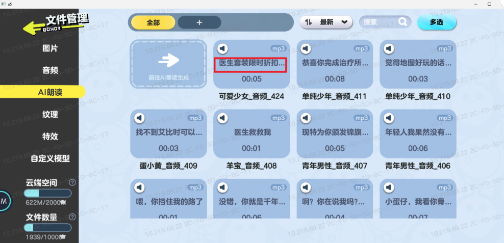
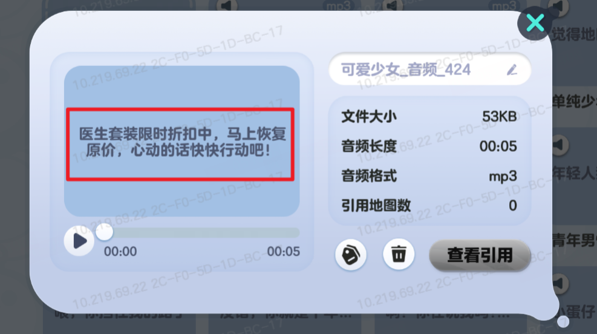

# 音频生成功能扩展需求

## 1. 功能概述

### 1.1 功能范围

1）本次需求统一升级音频生成服务接口，AI朗读与语音转换共用同一套新服务。  
2）本次新增部分音色。  
3）本次补充语音转换能力，允许用户输入语音或上传音频文件并转为指定音色。  

## 2. 基础规则

### 2.1 服务接口切换

1）本次音频生成统一升级为新服务接口，AI朗读与语音转换共用该接口。  
2）旧音色与新增音色均使用升级后的服务接口。  
3）新服务接入文档：  
https://docs.popo.netease.com/lingxi/e6c4613545e644f2b4113367ef73bdc6  

### 2.2 新增音色（策划配置）

1）本次语音转换新增一批可用音色，完整名单以策划配置表为准。  

| ID | 音色ID |
| --- | --- |
| 30 | 丐帮帮主 |
| 31 | 东北话女 |
| 32 | 乞丐 |
| ... | ... |
| 76 | 高冷男陪 |
| 77 | 高冷社恐男 |
| 78 | 魅惑女 |

### 2.3 语音转换能力补充

#### 2.3.1 功能流程

#### 2.3.2 次数限制

1）音频生成下，语音转换与AI朗读共用每日次数限制。  
2）真正扣减次数的时机为用户成功保存音频；仅试听、重新生成、不保存，不扣减次数。  

#### 2.3.3 保存与审核

1）保存后的音频保存到自定义文件【AI朗读】分类,默认名称为`用户语音_转{目标音色}_{序号}`。  
2）保存后默认以`审核中，完成后可试听`状态进入列表。  
3）保存后的音频需要走现有自定义音频审核链路（不同于之前AI朗读生成的音频无需审核）。     

### 2.4 新增配置表

#### 2.4.1 复用配置

| key | 说明 |
| --- | --- |
| AI_AUDIO_DAILY_LIMIT_NUM | AI朗读每日次数限制，语音转换复用该限制 |

#### 2.4.2 新增配置

| key | 说明 |
| --- | --- |
| VOICE_CONVERT_AUDIO_DURATION | 语音转换最短、最长音频时长 |
| VOICE_CONVERT_FILEPICKER_TIMEOUT | 语音转换上传超时时间 |
| VOICE_CONVERT_REQUEST_TIMEOUT | 语音转换服务请求超时时间 |

## 3. 界面交互

- 原型链接：https://cxy9355-glitch.github.io/voice-timbre-prototype/

### 3.1 音色升级角标

#### 3.1.1 涉及界面

- AI朗读、语音转换

#### 3.1.2 功能说明

| 控件/区域 | 变更类型 | 说明 |
|---|---|---|
| 音色标题区 | 新增 | AI朗读与语音转换的音色标题旁均新增`升级`角标 |

#### 3.1.3 交互逻辑

1）`升级`角标仅作升级标识展示，不响应点击。  

### 3.2 语音转换-待输入状态

#### 3.2.1 涉及界面

- 语音转换主界面-待输入状态

#### 3.2.2 功能说明

| 控件/区域 | 变更类型 | 说明 |
|---|---|---|
| 音色区 | 修改 | 保留主面板直选与`更多`弹窗选音色；仅当从`更多`中选中的音色不在主面板默认音色内时，回填到主面板第一位 |
| 输入语音区 | 新增 | 新增`...`入口，点击后展开`上传音频` |
| 录音中操作区 | 新增 | 录音中新增`取消`、`停止`按钮 |

#### 3.2.3 交互逻辑

1）点击主面板音色按钮时，仅切换当前选中音色，不改主面板排序；  
2）点击`更多`后打开完整音色弹窗，弹窗内当前选中音色排在第一位，点击`确认`后生效；  
3）若确认的音色不在主面板默认音色内，则回填到主面板第一位；后续切换主面板默认音色不改排序；  
4）点击`点击录音`后进入录音中态，显示`取消`、`停止`两个按钮；点击`取消`回到默认待输入，点击`停止`进入生成；  
- 若当前未获得录音授权，则需要自动拉起操作系统的录音授权页面；  

5）点击`...`后展开`上传音频`；点击`上传音频`后拉起手机文件选择页（同上传自定义音频），选中文件后直接进入生成中状态；  
6）生成中保留当前页面，录音入口、上传入口、音色切换、`更多`入口均不可操作。  

### 3.3 语音转换-生成后确认状态

#### 3.3.1 涉及界面

- 语音转换主界面-生成后确认状态

#### 3.3.2 功能说明

| 控件/区域 | 变更类型 | 说明 |
|---|---|---|
| 试听结果区 | 新增 | 新增原始语音、转换音频双试听卡片 |
| 音色区当前标识 | 新增 | 当前生效的生成配置对应音色显示`当前`标识 |
| 参数区 | 修改 | 该状态下保留音色、情绪、语速、音量可调 |
| 底部操作区 | 新增 | 新增常驻`重新录入`、`满意并保存`按钮 |

#### 3.3.3 交互逻辑

1）进入该状态后，页面展示原始语音、转换音频、音色、情绪、语速、音量；  
2）原始语音、转换音频均支持点击试听，再次点击停止；   
3）当前选中配置与上次生成配置完全一致时，`修改音色并重新生成`按钮置灰；任一项变更后按钮激活；  
4）点击`修改音色并重新生成`后重新进入生成中，期间`修改音色并重新生成`、`重新录入`、`满意并保存`均不可点击；  
5）退出与切换规则如下：
- 点击左上角退出按钮离开音频生成后，再次进入语音转换时，默认回到待输入状态；
- 仅在音频生成内通过左侧TAB切换AI朗读与语音转换时，保留语音转换当前状态，不做重置；
- 点击`重新录入`或`满意并保存`后，均回到语音转换待输入状态。  

### 3.4 已保存音频列表

#### 3.4.1 涉及界面

- 左侧已保存音频列表

#### 3.4.2 功能说明

| 控件/区域 | 变更类型 | 说明 |
|---|---|---|
| 语音转换列表项副文案 | 修改 | 审核中时不显示原副文案，改为`审核中，完成后可试听` |
| 播放按钮 | 修改 | 审核中时置灰 |
| 更多按钮 | 删除 | 审核中时隐藏 |

#### 3.4.3 交互逻辑

1）当分别位于【AI朗读】、【语音转换】两个不同的TAB页下，只对应显示通过两个功能各自生成的自定义音频。  
2）语音转换音频处于审核中时，列表项显示`审核中，完成后可试听`；  
3）审核中时播放按钮不可点击，`更多`按钮不显示。  

### 3.5 文件管理界面

#### 3.5.1 涉及界面

- 文件管理-音频列表
- 文件管理-音频详情弹窗

#### 3.5.2 功能说明

| 控件/区域 | 变更类型 | 说明 |
|---|---|---|
| 音频卡片文案区 | 修改 | 语音转换音频不显示用户原始输入文本 |
| 音频详情文案区 | 修改 | 语音转换音频详情内不显示用户原始输入文本 |

#### 3.5.3 交互逻辑

1）在文件管理的音频列表中，语音转换音频仅展示音频名称、时长等文件信息，不显示用户原始输入文本；  
2）在文件管理的音频详情弹窗中，语音转换音频不显示用户原始输入文本。  

## 4. USLOG

1）行为日志：
- 每次成功保存语音转换音频后，记录一次行为日志。  
- 每次成功保存AI朗读音频后，记录一次行为日志。  

2）结果日志：  
- 地图发布时，若包含AI朗读音频，则记录结果日志。 
- 地图发布时，若包含语音转换音频，则记录结果日志。  
